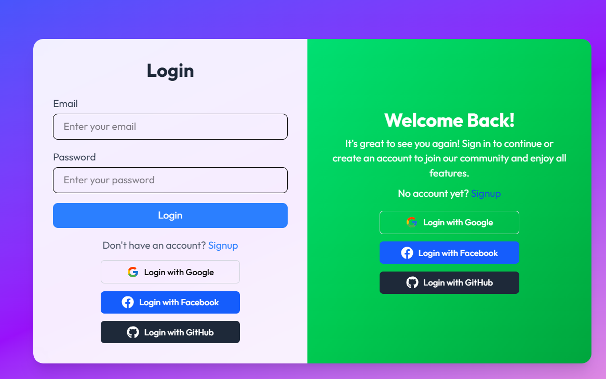
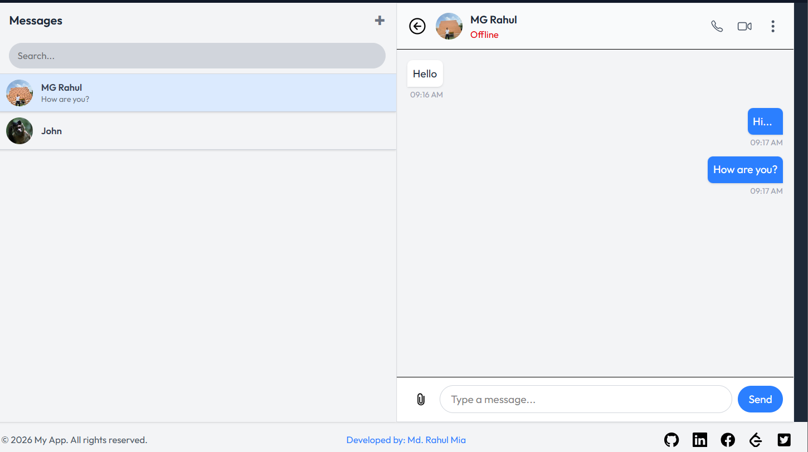

# 💬 Chat Application

A modern **real-time chat application** built with **React**, **Vite**, and **Tailwind CSS**.  
This project provides a clean UI, fast performance, and real-time messaging using **Socket.io**, along with **Passport.js** authentication supporting both local and social login.

---

# ⚙️ Tech Stack

## Frontend

- React 19
- Vite
- React Router DOM
- Axios
- Framer Motion
- React Icons
- React Hot Toast
- Socket.io Client

## Styling

- Tailwind CSS v4
- Tailwind CSS Vite Plugin

## Backend

- Express.js
- Socket.io
- MongoDB
- Mongoose
- Cloudinary

## Authentication

- Passport.js
- Email & Password Authentication
- Google Login
- GitHub Login
- Facebook Login

## Development Tools

- ESLint
- Vite Plugin React
- React Hooks ESLint Plugin

---

# ✨ Features

- Real-time messaging with Socket.io
- Modern and responsive UI
- Smooth animations using Framer Motion
- Toast notifications for user actions
- Protected routes and authentication
- Social login support (Google, GitHub, Facebook)
- Clean and scalable component structure

---

# 📸 Project Screenshots

## 🏠 Login Page



---

## 💬 Message Box



---

# 🚀 How to Run the Project Locally

## Step 1 — Clone Both Repositories

### Frontend

Frontend Repo:  
https://github.com/mgrahul63/chat-frontend

```bash
git clone https://github.com/mgrahul63/chat-frontend.git
cd chat-frontend
npm install
npm run dev
```

Frontend runs at:  
http://localhost:5173

---

### Backend

Backend Repo:  
https://github.com/mgrahul63/chat-backend

```bash
git clone https://github.com/mgrahul63/chat-backend.git
cd chat-backend
npm install
npm run server
```

Backend runs at:  
http://localhost:4000

---

# 🔐 Authentication

Users can log in using:

- Email & Password
- Google
- GitHub
- Facebook

---

# 🧪 Demo User Credentials

Email: `test@gmail.com`  
Password: `123456`

Or log in using your social accounts.

---

# 📁 Project Structure

```
chat-application/
│
├── public/
├── src/
│   ├── components/
│   ├── pages/
│   ├── context/
│   ├── hooks/
│   ├── utils/
│   └── App.jsx
│
├── package.json
└── vite.config.js
```

---

# 👨‍💻 Author

**MD. Rahul Mia**  
Jatiya Kabi Kazi Nazrul Islam University (JKKNIU)

---

# ⭐ Support

If you like this project, give it a ⭐ on GitHub.
